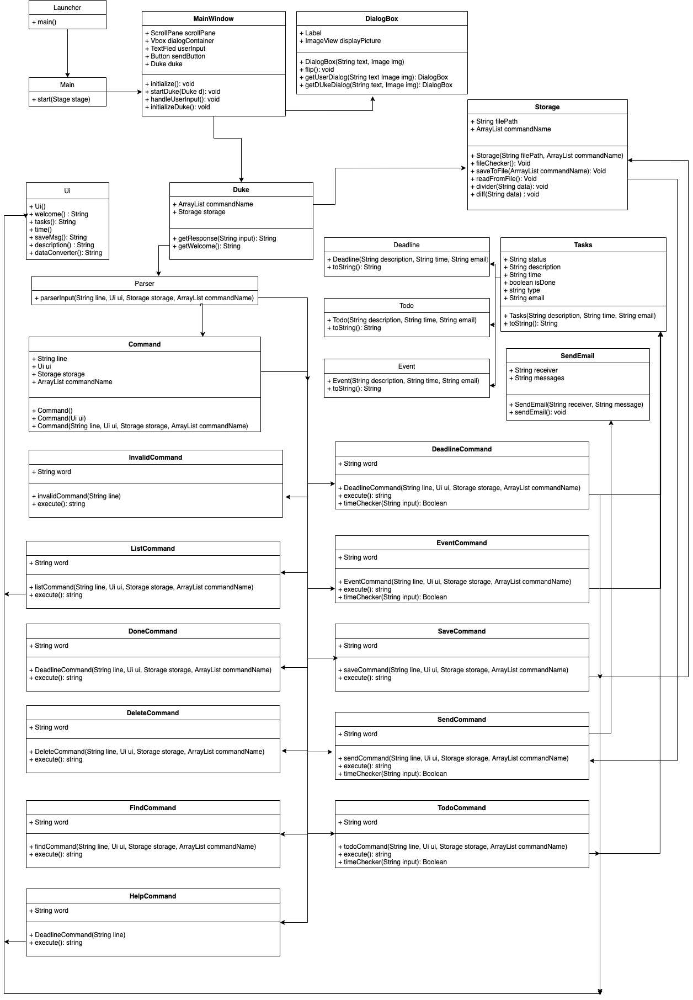
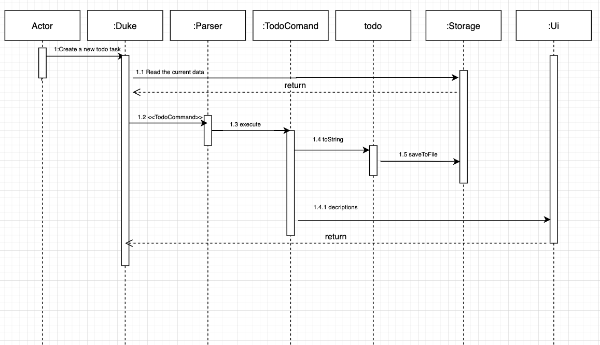

# Developer Guide

## Design & implementation

This product is an personal use project that helps user to keep track of his daily tasks.
## Design

### UML diagram 
 

### Todo method

### Ui picture

## Product scope
### Target user profile

The target user is a busy person who can keep tracking his daily tasks, know the deadline of each task and complete the task within the deadline.

### Value proposition

Project Duke will help to solve to tracking and managing tasks. It will involve description of each task. 

## User Stories

|Version| As a ... | I want to ... | So that I can ...|
|--------|----------|---------------|------------------|
|v3.0|new user|see usage instructions|refer to them when I forget how to use the application|
|v3.0|busy person|create a task|put in the task information|
|v3.0|busy person|add date and time for deadline tasks| remind myself and complete the task within the deadline|
|v3.0|busy person|add date and time for event tasks| remind myself and attend the task with specific date and time|
|v3.0|busy person|add the description to the task|know what is the task about|
|v3.0|busy person|save my project in a txt file|keep a record for reference|
|v3.0|busy person|delete my project| reduce the clutter|
|v3.0|busy person|have a abbreviation and status of different types of task|have a quick look for each types of tasks| |
|v3.0|busy person|show a total number of tasks|remind myself and have a timeframe for tasks|
|v3.0|busy person|know the same description of different tasks|find a relevant task with relevant description|
|v3.0|busy person|catch all input exceptions | ensure is valid input in send|
|v3.0|busy person|create done command to set a task to complete| ensure task can update to be done|
|v3.0|busy person|send me the reminder of the tasks when the deadline is close| so that i will been notify|
|v3.0|busy person|fix all checkstyle errors| inorder to pass the CI test|

## Non-Functional Requirements

* Operation Environment: Project Duke works on any Mainstream OS as long as it has Java **11** or above installed. 
* Usability: A command line interface application, user will use specified command to interact with the system.
* Capacity: Project Duke should be able to record at least 1,000 project records. 
* Reliability / Availability: Once the project Duke has been successfully deployed on user's computer, availability is 24/7.   
* Scalability: The current version of project Duke only support local data file storage, users are unable to share a centralised project data.
               If the need of having a centralised data storage raised in the future, it can be added as system enhancement. 
* Security: User login is being not required by user. The project Duke use user's computer login as authentication.
* Maintainability: A updated JAR file will be released to user if there is any update to the current version of the project tracker.                 
               
## Glossary

* Mainstream OS * - Windows, Mac and Linux

## Instructions for manual testing

Start the program
*    1. Download the Jar file and copy into an empty folder
*    2. Use terminal/CMD to run jar file with `java -jar` command.
*    3. type exit command or double enter to exit the program.
